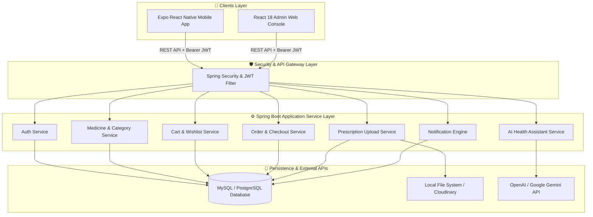
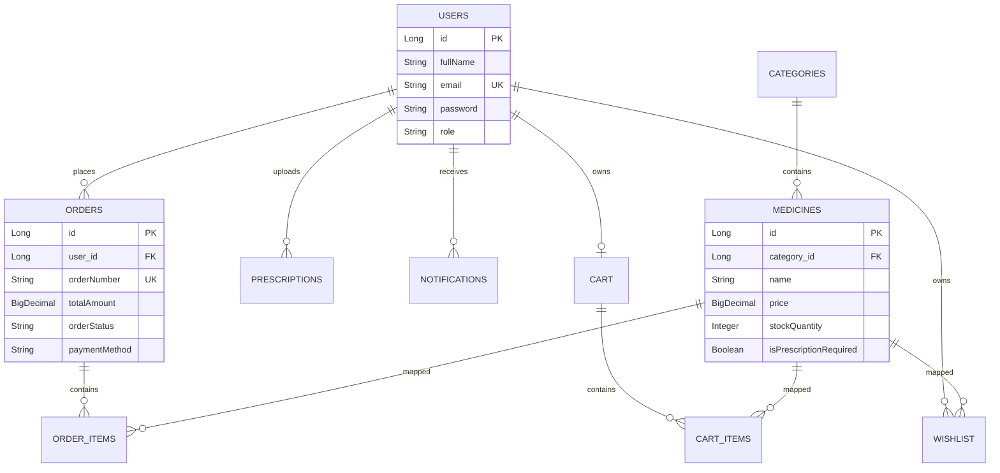

# 🏥 PharmaGo Healthcare Platform

[](https://spring.io/projects/spring-boot)
[](https://reactnative.dev/)
[](https://www.typescriptlang.org/)
[](https://www.docker.com/)
[](LICENSE)

**PharmaGo** is an enterprise-grade, full-stack online pharmacy and healthcare platform built to connect customers with digital pharmaceutical services. Featuring an **AI-Powered Health Assistant**, digital doctor prescription verification, real-time order tracking, and mobile-first experience, PharmaGo provides end-to-end pharmaceutical commerce for modern healthcare providers.

---

## 📋 Table of Contents

- [Features](#-features)
- [Architecture](#-architecture)
- [Tech Stack](#-tech-stack)
- [Project Structure](#-project-structure)
- [Database Design](#-database-design)
- [API Documentation](#-api-documentation)
- [Installation & Setup](#-installation--setup)
- [Environment Variables](#-environment-variables)
- [Docker Deployment](#-docker-deployment)
- [CI/CD Pipeline](#-cicd-pipeline)
- [Screenshots](#-screenshots)
- [Security Implementation](#-security-implementation)
- [Roadmap](#-roadmap)
- [Contributors & License](#-contributors--license)

---

## ✨ Features

### 🔐 Authentication & Authorization
- **JWT Authentication:** Secure Access Tokens (24h validity) & Refresh Tokens (7d validity).
- **Password Hashing:** `BCryptPasswordEncoder` with salt.
- **Role-Based Access Control (RBAC):** `ROLE_CUSTOMER` and `ROLE_ADMIN` route protection.

### 💊 Medicine Catalog & Search
- **Dynamic Category Management:** OTC medicines, Prescription drugs, Health supplements, Personal care.
- **Advanced Filtering & Search:** Search by name, category, brand, price range, and prescription requirements (`isPrescriptionRequired`).

### 🛒 Shopping Cart & Wishlist
- **Persistent Cart Engine:** Automatic subtotal, taxes, and free delivery thresholds (`> ₹500`).
- **Wishlist Synchronization:** One-tap save and move-to-cart features.

### 📄 Prescription Upload & Verification
- **Multi-Format Uploads:** Image (JPG, PNG) and Document (PDF) prescription uploads via Expo Camera/Gallery.
- **Pharmacist Queue Review:** Pharmacist approval/rejection workflow with admin notes.

### 📦 Order Management & Tracking
- **Order Lifecycle:** Status timeline (`ORDERED` ➔ `CONFIRMED` ➔ `PACKED` ➔ `SHIPPED` ➔ `DELIVERED` ➔ `CANCELLED`).
- **Payment Method Selection:** Cash on Delivery (COD), UPI, Credit/Debit Cards.

### 🔔 Notifications System
- **Real-Time Order & Prescription Updates:** Automated in-app alerts on status changes.
- **Unread Count & Mark-Read Engine.**

### 🤖 AI Health Assistant
- **AI-Powered Medical Guidance:** Integration with OpenAI & Google Gemini REST APIs.
- **Strict Guardrails:** Built-in medical disclaimer and symptom education bounds.

### 📊 Admin Portal & Analytics
- **Management Console:** Catalog management, order status timeline updates, prescription review queue, and revenue insights.

---

## 🏗 Architecture



---

## 🛠 Tech Stack

| Domain | Technology / Framework |
| :--- | :--- |
| **Backend Framework** | Java 17, Spring Boot 3.2.0 |
| **Security** | Spring Security, JJWT (0.11.5), BCrypt |
| **Persistence** | Spring Data JPA, Hibernate, MySQL 8 / PostgreSQL 16 |
| **Mobile Client** | React Native, Expo SDK, TypeScript, React Navigation v6 |
| **State Management** | Zustand (with AsyncStorage persistence), React Query v5 |
| **HTTP Client** | Axios (with Request/Response JWT Interceptors) |
| **Admin Web Console** | React 18, Vite, TypeScript |
| **DevOps & Containers** | Docker, Docker Compose, Nginx Reverse Proxy, GitHub Actions |

---

## 📁 Project Structure

```
PharmaGo/
├── .github/
│   └── workflows/
│       └── deploy.yml                   # CI/CD Deployment Pipeline
├── docker-compose.yml                   # Multi-container Orchestrator
├── Dockerfile                           # Backend Multi-Stage Dockerfile
├── docs/
│   └── PRODUCTION_DEPLOYMENT.md        # Comprehensive Production Guide
├── nginx/
│   └── nginx.conf                       # Reverse Proxy Configuration
├── pharmago-mobile/                     # Expo React Native App
│   ├── src/
│   │   ├── api/                         # Axios Client & Interceptors
│   │   ├── components/                  # Reusable UI Components
│   │   ├── constants/                   # Environment & Keys
│   │   ├── hooks/                       # Custom React Query Hooks
│   │   ├── navigation/                  # Auth & Main Navigation
│   │   ├── screens/                     # Customer & Auth Screens
│   │   ├── services/                    # API Service Modules
│   │   ├── store/                       # Zustand Stores
│   │   ├── theme/                       # Design System & Tokens
│   │   └── types/                       # TypeScript Definitions
│   ├── App.tsx                          # Application Entry Point
│   ├── app.json                         # Expo Manifest
│   ├── package.json
│   └── tsconfig.json
├── pom.xml                              # Maven Project Manifest
└── src/
    └── main/
        ├── java/com/pharmago/
        │   ├── config/                  # Security & AI Config
        │   ├── controller/              # REST API Controllers
        │   ├── dto/                     # Request & Response DTOs
        │   ├── enums/                   # Order, Payment & Role Enums
        │   ├── exception/               # Global Exception Handlers
        │   ├── model/                   # JPA Entity Domain Models
        │   ├── repository/              # Spring Data JPA Interfaces
        │   ├── security/                # JWT Provider & Filter
        │   ├── service/                 # Service Interfaces & Impls
        │   └── specification/           # JPA Search Specifications
        └── resources/
            └── application.yml          # Backend Configuration
```

---

## 🗄 Database Design

### Entity Relationships Diagram



---

## 🔌 API Documentation

### 🔓 Public Authentication Endpoints
| Method | Endpoint | Description | Auth Required |
| :--- | :--- | :--- | :--- |
| `POST` | `/api/v1/auth/register` | Register new customer | ❌ Public |
| `POST` | `/api/v1/auth/login` | Authenticate & return JWT tokens | ❌ Public |
| `POST` | `/api/v1/auth/refresh-token` | Exchange refresh token for access token | ❌ Public |

### 💊 Medicines & Categories
| Method | Endpoint | Description | Auth Required |
| :--- | :--- | :--- | :--- |
| `GET` | `/api/v1/categories` | List all categories | ❌ Public |
| `GET` | `/api/v1/medicines` | Search & paginate medicine catalog | ❌ Public |
| `GET` | `/api/v1/medicines/{id}` | Get medicine details by ID | ❌ Public |
| `POST` | `/api/v1/medicines` | Create new medicine item | 🔒 Admin |

### 🛒 Cart & Wishlist
| Method | Endpoint | Description | Auth Required |
| :--- | :--- | :--- | :--- |
| `GET` | `/api/v1/cart` | Get current user cart | 🔒 Customer |
| `POST` | `/api/v1/cart/items` | Add item to cart | 🔒 Customer |
| `PUT` | `/api/v1/cart/items/{id}` | Update item quantity | 🔒 Customer |
| `DELETE` | `/api/v1/cart/items/{id}` | Remove item from cart | 🔒 Customer |
| `GET` | `/api/v1/wishlist` | Get user wishlist | 🔒 Customer |
| `POST` | `/api/v1/wishlist/{medicineId}` | Toggle item in wishlist | 🔒 Customer |

### 📦 Orders & Prescriptions
| Method | Endpoint | Description | Auth Required |
| :--- | :--- | :--- | :--- |
| `POST` | `/api/v1/orders/checkout` | Process checkout & create order | 🔒 Customer |
| `GET` | `/api/v1/orders` | Fetch user order history | 🔒 Customer |
| `GET` | `/api/v1/orders/{id}` | Fetch order details & tracking | 🔒 Customer |
| `PUT` | `/api/v1/orders/{id}/status` | Update order status | 🔒 Admin |
| `POST` | `/api/v1/prescriptions/upload` | Upload doctor prescription | 🔒 Customer |
| `PUT` | `/api/v1/prescriptions/{id}/review` | Pharmacist prescription review | 🔒 Admin |

### 🤖 AI Health Assistant & Notifications
| Method | Endpoint | Description | Auth Required |
| :--- | :--- | :--- | :--- |
| `POST` | `/api/v1/ai/chat` | Ask AI Health Assistant question | 🔒 Customer |
| `GET` | `/api/v1/notifications` | Fetch user notifications | 🔒 Customer |
| `GET` | `/api/v1/notifications/unread-count` | Get unread notifications count | 🔒 Customer |

---

## ⚙️ Installation & Setup

### 1. Prerequisites
- Java 17 JDK
- Node.js (v18+) & npm
- MySQL 8.0+ or PostgreSQL 16
- Expo CLI (`npm i -g expo-cli`)

### 2. Backend Setup
```bash
# Clone Repository
git clone https://github.com/Raju3114/pharmago-healthcare-platform.git
cd pharmago-healthcare-platform

# Configure Database in src/main/resources/application.yml
# Build Backend
mvn clean package -DskipTests

# Run Spring Boot Application
mvn spring-boot:run
```

### 3. Mobile App Setup
```bash
cd pharmago-mobile

# Install Dependencies
npm install

# Start Expo Development Server
npx expo start
```

---

## 🔑 Environment Variables

### Backend (`application.yml`)
| Variable | Default Value | Description |
| :--- | :--- | :--- |
| `DB_HOST` | `localhost` | Database Host Address |
| `DB_NAME` | `pharmago` | Database Name |
| `DB_USER` | `root` | Database Username |
| `DB_PASS` | `password` | Database Password |
| `JWT_SECRET` | `404E635266556A586E327235753878...` | Secret key for JWT signing |
| `OPENAI_API_KEY` | `your_openai_api_key_here` | API Key for AI Assistant |

### Mobile Client (`pharmago-mobile/src/constants/env.ts`)
| Variable | Value | Description |
| :--- | :--- | :--- |
| `API_BASE_URL` | `http://10.0.2.2:8080/api/v1` | Android Emulator API URL |
| `TIMEOUT` | `15000` | Request timeout in ms |

---

## 🐳 Docker Deployment

To launch the complete infrastructure stack locally or on cloud servers:

```bash
# Build and Launch Containers in Detached Mode
docker-compose up -d --build

# View Logs
docker-compose logs -f backend

# Stop Containers
docker-compose down
```

---

## 🚀 CI/CD Pipeline

PharmaGo includes a pre-configured **GitHub Actions Workflow** (`.github/workflows/deploy.yml`):
- **Automated JDK 17 Setup & Caching**
- **Maven Build & Unit Verification**
- **Docker Image Build & Push to Docker Hub**
- **Automated Deployment trigger via SSH**

---

## 📱 Screenshots

| Login & Authentication | Home Dashboard | Medicine Details |
| :---: | :---: | :---: |
| *(Screenshot Placeholder)* | *(Screenshot Placeholder)* | *(Screenshot Placeholder)* |

| Cart & Checkout | Order Tracking | AI Health Assistant |
| :---: | :---: | :---: |
| *(Screenshot Placeholder)* | *(Screenshot Placeholder)* | *(Screenshot Placeholder)* |

---

## 🛡 Security Implementation

- **JWT Stateless Authentication:** Bearer tokens validated on every API request.
- **BCrypt Encryption:** Passwords hashed with standard work factor 10.
- **Input Validation:** Strict JSR-380 validation annotations (`@NotNull`, `@Size`, `@Email`, `@Min`).
- **Sanitized Uploads:** File size restrictions, extension verification, and safe local directory mapping.

---

## 🗺 Roadmap

- [x] Phase 1: Core Commerce, JWT Auth & Prescription Uploads
- [x] Phase 2: AI Health Assistant & Mobile Interface
- [x] Phase 3: Order Lifecycle & In-App Notifications
- [ ] Phase 4: Razorpay Payment Gateway Live Integration
- [ ] Phase 5: Firebase Cloud Messaging (FCM) Push Notifications
- [ ] Phase 6: Cloudinary S3 File Hosting Migration

---

## 🤝 Contributors & License

**Maintainer:** [Raju3114](https://github.com/Raju3114)  
**Repository:** [https://github.com/Raju3114/pharmago-healthcare-platform](https://github.com/Raju3114/pharmago-healthcare-platform)

Distributed under the **MIT License**. See `LICENSE` for more information.
